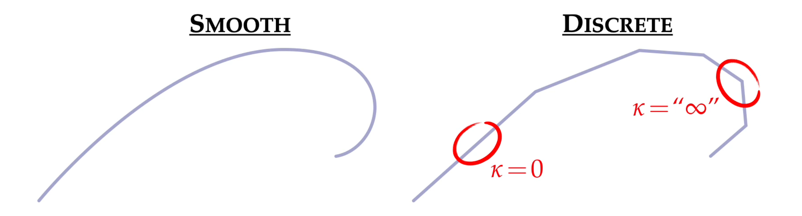
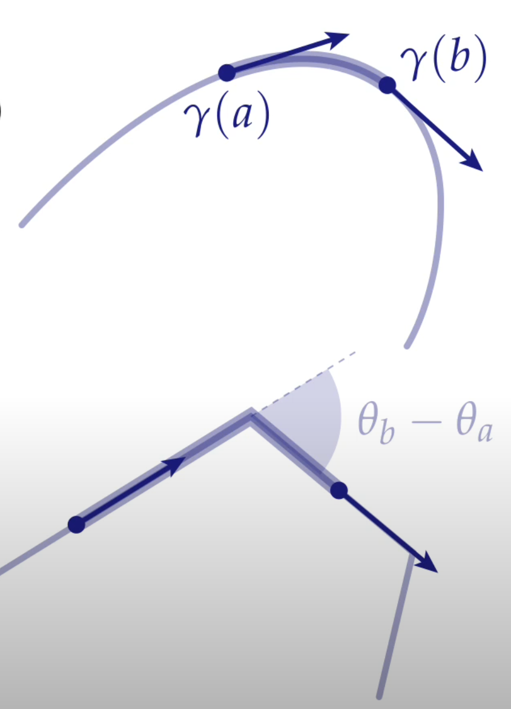
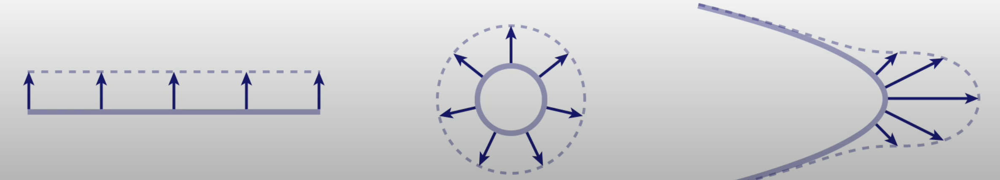
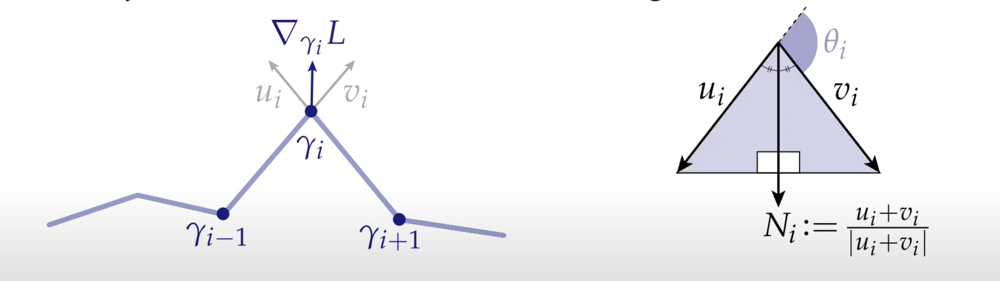
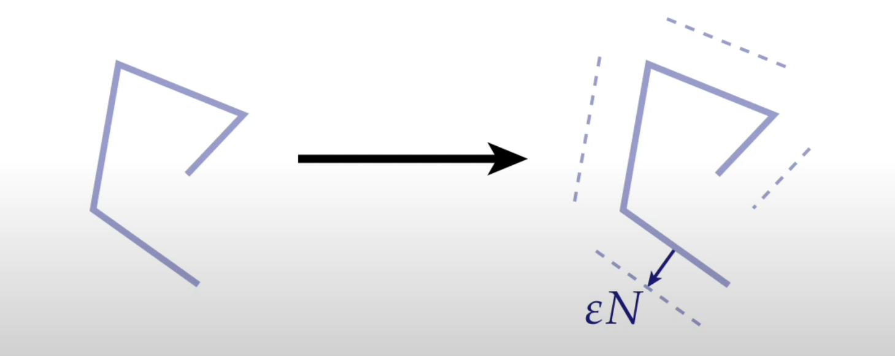
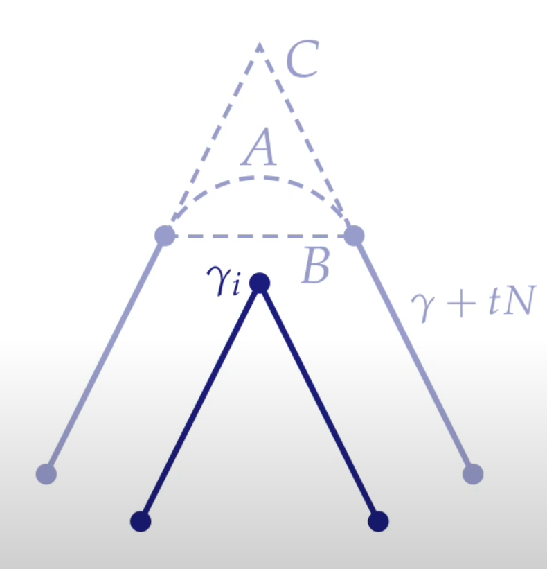
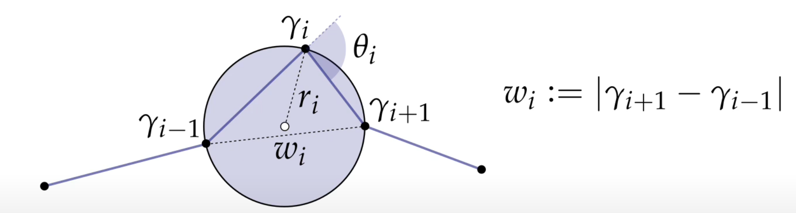

# DDG overview

## 曲率(curvature)

对于连续的曲率计算，一般采用公式：

$$\kappa = <\jmath \frac{d}{ds} \gamma , \frac{d^2}{ds^2} \gamma >$$

其中， $\gamma(s)$ 是曲线的参数化表示，尖括号 $<>$ 表示向量内积， $\jmath$ 的意思是旋转 $90^\circ$ ，也就是说第一个 值代表了曲线上的法线方向，而第二个值是曲线的二次导数，总体的意思代表了曲线的弯曲程度，且因为与法线方向进行了内积，所以正负号也有其意义，代表了曲线向哪里弯曲。

## 曲率的离散化表达

虽然曲率的连续性表达很简单，但一旦涉及到离散化便会很困难，例如在离散化曲线上，只有点与点之间的直线以及连接的顶点，也就是说，只有导数为 $1$ 或者 $\infty$ 的点，这对二阶导数是没有意义的。

那么自然就需要用别的方式来表示曲线：

### 利用角度变换方法
首先，曲率是曲线的参数表达式的二阶导，也就是曲线参数表达式切线的导数，而**切线**代表了曲线在某一点的运动方向，那么切线的导数可以认为是**方向**的变化率，因此也就想到了可以用角度（方向）的变化来代替原公式：

$$\int_a^b\kappa(s)ds=\int_a^b\frac{d}{ds}\phi(s)ds=\phi(b)-\phi(a)$$

虽然只有积分上的变换，但这是可行的，只要限定a与b在曲线上的位置即可。

### 利用曲线长度变换方法

曲率还反应了一件事情，就是如果你对一个曲线进行按压或者拉伸，如果你沿着曲线某一点的法线方向，并以与曲率成正比的速度，那么这跟曲线将会以最快的速度减小（拉长），比如：

想象如果有一根曲线 $\gamma(s)$ ，如果现在使用一个函数 $\eta(s)$ ，这个函数表示了在曲线的 $s$ 位置上，曲线的移动方向（输入一个 $s$ ， $\eta$ 函数输出一个方向），假设在曲线上的每一点都施加同样大小的位移 $\epsilon$ ，则整条曲线长度的**变化率**之和为：

$$\frac{d}{d\epsilon}length(\gamma+\epsilon\eta)=-\int_0^L<\eta(s),\kappa(s)N(s)>ds$$

其中等式左边表示了曲线长度的变化率，等式右边的积分意义是：对于曲线的每一点 $s$ ， $\kappa(s)N(s)$ 表示了曲线* **弯曲** *的大小与方向，且因为曲率代表了曲线，那么 $<\eta(s),\kappa(s)N(s)>$ 就表示了曲线在 $\eta(s)$ 方向上长的变化的大小，对曲线上每一点进行积分后，就是曲线长度变化的大小，或者说是曲线长度的梯度。那么自然想要让这个内积最大， $\eta(s)$ 必须与 $\kappa(s)N(s)$ 同方向。

那么对于离散的曲线来讲，我们在计算曲线形状变化的时候就不一定需要直接计算曲率了，而是计算其长度变化的梯度来的更方便：

曲线长度的梯度：

$$\bigtriangledown_{\gamma_iL}=2sin(\theta_i/2)N_i$$

也就是顶点两侧直线的单位方向之和。

而又因为：

$$\bigtriangledown_{\gamma_iL}=\kappa(s)N(s)$$

因此，通过这种方式，同样也可以求出曲率 $\kappa(s)$ 。

### Steiner公式方法
Steiner公式告诉了我们一件事情，就是曲线某一点朝某一个特点方向的变化导致的长度变化大小，与曲率成正比：

$$length(\gamma+\epsilon N)=length(\gamma)-\epsilon\int_0^L\kappa(s)ds$$

如果写成离散的形式就会变成：

$$length(\gamma+\epsilon N)=length(\gamma)-\epsilon \sum_i \kappa_i$$

既然Steiner公式在计算曲线因朝某个方向形变而导致的长度大小变化，那么如果我们能在离散的情况下计算出曲线长度的变化，那么也能求出曲率的大小。

那么试想一下如果将离散曲线的每一小段都朝各自的法线方向移动 $\epsilon$ 的距离，那么移动后曲线的长度总和为多少？

那么实际上有3种连接方式：

+ A表示用一个单位圆上的弧线代替这一段长度变化
+ B表示用一条直线直接连接两端线段的端点来代替长度变化
+ C表示分别延长两个线段直至相交，用这个延长线来替代长度变化

利用这三种方式计算长度变化的总和能得到：

$$length_A=length(\gamma)-\epsilon \sum_i \theta_i$$

$$length_B=length(\gamma)-\epsilon \sum_i 2sin(\theta_i/2)$$

$$length_C=length(\gamma)-\epsilon \sum_i 2tan(\theta_i/2)$$

上述A和B两种方法对于曲率的度量已经提过，C就是Steiner方法所得到的在离散情况下对于曲率的近似：

$$\kappa_i=2tan(\theta_i/2)$$

### 射圆(Osculating Circle)方法

众所周知曲率大小可以被视为射圆半径的倒数：

$$\kappa(p)=\frac{1}{r(p)}$$

那么也就是说可以通过计算射圆的半径大小，来近似离散曲线上顶点的曲率：

因此曲率的公式是：

$$\kappa_i=\frac{1}{r_i}=2sin(\theta_i)/ \omega_i$$