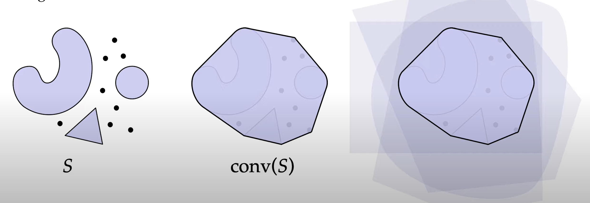

# 网格

## 凸(convex)

**凸**的定义：

对于任意一个空间的子集 $S\subset \mathbb{R}^n$ ，如果任意一对点 $\boldsymbol{p,q}\in S$ ，他们之间的连续都在这个子集内，那么这个子集就是**凸**的。

## 凸包
凸包的定义是：

对于任意一个空间的子集 $S\subset \mathbb{R}^n$ ，其凸包 $conv(s)$ 就是空间中最小的能包括 $S$ 的凸的空间集合，或者说是能够包含空间子集 $S$ 的所有凸的集合的交集。

> 从左到右依次是：空间子集 $S$ 、 $S$ 的凸包、可以包含 $S$ 的所有凸的集合的交集

> 以上**凸**和**凸包**的定义都十分抽象，退域凸包，就想像成有一个橡皮筋，在一个平面上有许多的点和线段，类似于在一个木板上钉上了许多钉子，用橡皮筋将这些钉子都框在里面后，松手让橡皮筋收紧，这个橡皮筋收紧后的形状构成的小的二维空间，就是在二维上的一个凸包，对于其他维度同理。

## 相关性

### 线性相关

### 仿射相关
