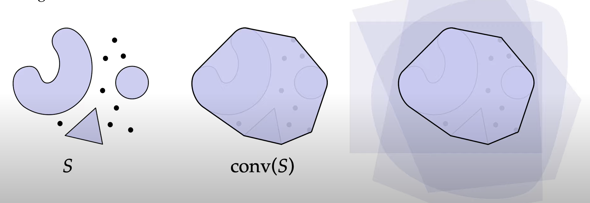

# 网格

## 凸(convex)

**凸**的定义：

对于任意一个空间的子集 $S\subset \mathbb{R}^n$ ，如果任意一对点 $\boldsymbol{p,q}\in S$ ，他们之间的连续都在这个子集内，那么这个子集就是**凸**的。

## 凸包
凸包的定义是：

对于任意一个空间的子集 $S\subset \mathbb{R}^n$ ，其凸包 $conv(s)$ 就是空间中最小的能包括 $S$ 的凸的空间集合，或者说是能够包含空间子集 $S$ 的所有凸的集合的交集。

> 从左到右依次是：空间子集 $S$ 、 $S$ 的凸包、可以包含 $S$ 的所有凸的集合的交集

> 以上**凸**和**凸包**的定义都十分抽象，退域凸包，就想像成有一个橡皮筋，在一个平面上有许多的点和线段，类似于在一个木板上钉上了许多钉子，用橡皮筋将这些钉子都框在里面后，松手让橡皮筋收紧，这个橡皮筋收紧后的形状构成的小的二维空间，就是在二维上的一个凸包，对于其他维度同理。

## 相关性

### 线性无关
如果一组向量 $v_1,v_2,\cdots,v_n$ 是线性无关的，那么也就是说没有任何一个向量能被别的一些向量线性表示。

换一种说法就是，如果这样想，一个向量可以表示这个向量方向上的所有直线，两个线性无关的向量可以表示一个平面，三个线性无关的向量可以表示一个三维空间。

如果说有向量是线性相关的，那么也即是说，有一个向量“躺”在可别的向量张成的空间，就像上面的例子中，一维向量的张成空间是它所在方向上的一条直线，那么线性相关就是说有一个向量与这个向量共线；两个向量的张成空间是一个平面，如果说有一个向量与这两个向量线性相关，那么就是说这个向量也在这个二维平面内了。

### 仿射无关
如果说有一堆点 $p_0,p_1,\cdots,p_k$ 仿射无关，那么就是说所有的向量 $v_i:=p_i-p_0$ ，这些向量线性无关。

## 简单形(Simplex)

简单形的定义是：一个 $k$ 简单形，是由 $k+1$ 个仿射无关的点所构成的凸包，而这 $k+1$ 个点就被成为这个 $k$ 简单形的顶点。

> 从左到右依次是0简单形，1简单形，2简单形，3简单形。可以看出k代表了简单形的维度数。
> 值得注意的是，简单形是实心的！

### 简单形的坐标系统
因为简单形是由k $k+1$ 个仿射无关的点组成的，因此构成其边的向量也是线性无关的，那么就可以利用这些线性无关的向量来作为空间的**基**来构成坐标。

这种构成坐标的方法就是**重心坐标**

任意位于k简单形 $\sigma$ 内的一点 $p$ 可以被 $\sigma$ 的顶点的权重组合来表示，比如对于1简单形：

p点的坐标可以被写为：

$$\boldsymbol{p}:=\frac{1}{4}\boldsymbol{a}+\frac{3}{4}\boldsymbol{b}$$

因此k简单形 $\sigma$ 也可以被表示为：

$$\sigma=\{\sum_{i=0}^{k}{t_ip_i}|\sum_{i=0}^k{t_i}=1,t_i \ge 0 \forall i\}$$

其中 $p_i$ 代表 $\sigma$ 的顶点。

最后，**标准**k简单形可以被定义为其坐标之和为1的简单形，同时这样的简单形也被称为概率简单形：

$$\sigma=\{(x_0,x_1,\cdots,x_k)| \sum_{i=0}^k{x_i}=1,x_i \ge 0 \forall i\}$$

## 简单复形
简单复形就是一堆简单形的集合

### 简单形的面
一个简单形 $\sigma$ 的面就是任意顶点是由 $\sigma$ 的顶点组成简单形。

> 图中的点、线、面均是简单形 $\sigma$ 的“面”，此外<u>空集也算一个面</u>

## 简单形的运算
### 闭包(Closure)
简单形的闭包指最小的能包括所给简单形集合的简单复形。

### 星(Star)
所有包含所给简单集合的简单形的并集

### 链(link)

所给简单形子集的星的闭包减去闭包的星。

## 简单形的方向

对于一个给定的简单形的顶点标号集合，简单形的顶点的偶排序就是简单形的正方向，简单形顶点的奇排序就是它的负方向。

> 所谓偶排序、奇排序，就是一个序列，其逆序数为偶数或者奇数的时候。逆序数就是说在排序中，排在前面的一个数比排在后面的某一个数大的数量。比如：$(1,3,2,4)$ 就是一个奇排序，因为只有逆序数为1，即 $(3,2)$ 这一组；对于 $(3,4,1,2)$ 就是一个偶排序，因为有 $(3,1),(3,2),(4,1),(4,2)$ 这4组前一个数比后面某个数大的组合，逆序数为4，因此是偶排序。

当然方向的正负依旧是人为选定的，可以类比于左手系和右手系，y轴的正负就是被人为选定的（左手系认为向左为正，而右手系认为向右为正），当选定了正负之后，再去讨论简单形顶点的奇偶排列才有意义。

### 有向简单形
有向简单形是一种考虑了其顶点顺序的简单形。

### 相对朝向
如果两个不同的简单形有同样的相对朝向，那么他们相交处的最大面有完全相反的朝向。

类似于上图两个三角形，他们是有同样的相同朝向的，而且各自的相交的“面”（直线bc）的顺序分别为 $(c,b)$ 和 $(b,c)$ ，是相反的顺序。