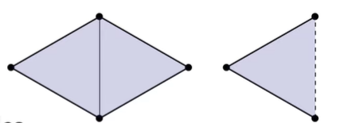
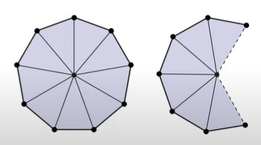
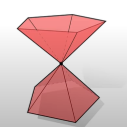

# 流形
为什么会引入“流形”的概念：我们在操作空间中的几何的时候，都希望几何形状能有一些很好的特性，比如说球形或者正方体在各种意义上都十分好计算，但现实中的图形大部分都不会如此规整，比如说人体的建模就十分的复杂，不可能用简单的方程来计算，但为了更好的研究图形，必须引入一些概念来判断图形的好坏，这个概念就是**流形**。

如果一个图形它是**流形**，虽然它看起来会十分复杂，但是**流形**会有良好的局部性，也就是说如果只看流形上极小的一个范围，那这个范围可能有着类似于二维平面上的正交坐标系的特性，这就会很利于我们对于图形的研究。

## 流形的定义
流形的定义如下：
一个简单k复形（仅由k简单形组成的一个图形），如果它是流形，那么它的每一个顶点的**链**，都看起来像是一个 $(k-1)$ 维的球面。

虽然这个定义很严谨，但是在计算机上如果使用这个定义来检查一个图形是否是流形未免过于复杂，因此在计算机上，采用另一种方式来检查三角形网格流形，即 $k=2$ （计算机上的图形大致都可以视作一个简单2复形）：

1. 每一个边都**仅**与两个三角形相连，不过如果这条边是边界的话，允许只与一个三角形相连。

2. 对于一个顶点都会有许多三角形与其相连，每一个顶点，与其相连的三角形循环只会有唯一的一个，如果这个顶点在边界上，那么就会变为只有一个唯一的三角形扇面与其相连。

最后，上面两点分别对应下图的情况。

> 对于第二点，其意思其实是避免如沙漏中心点的顶点——一个顶点与两个三角形网格面相连，像下图的沙漏形就不是流形，因为它中间的顶点不符合第二点。

