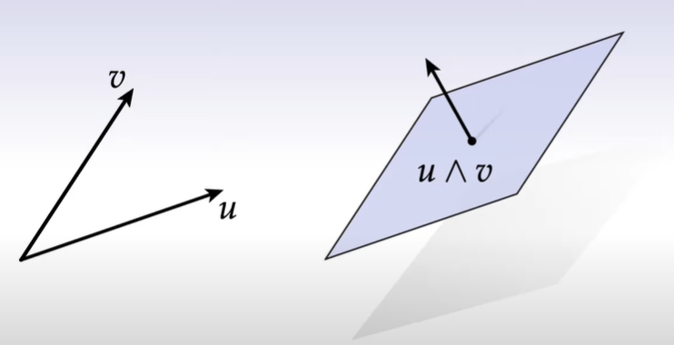
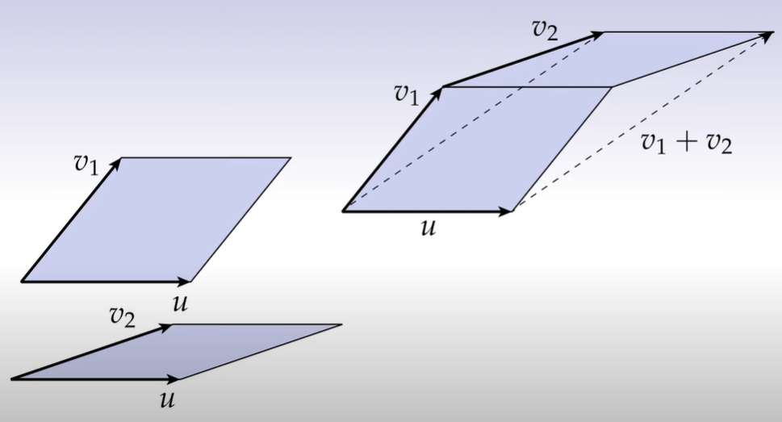
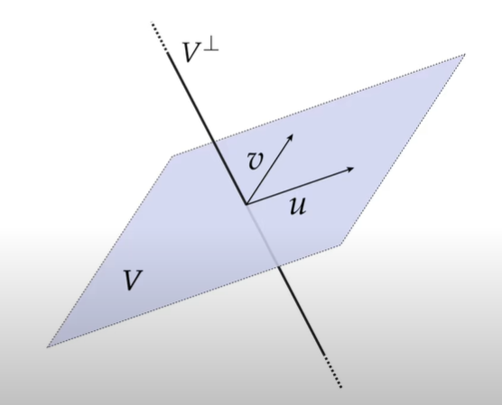
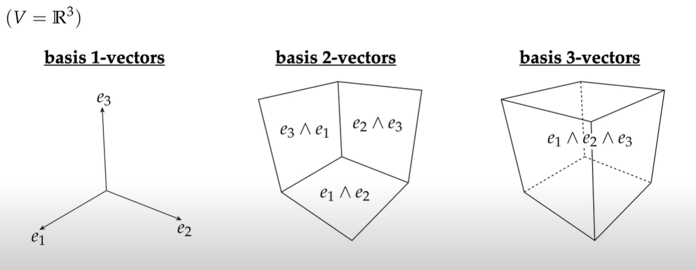

# 外代数
外代数是一种用来描述几何空间的代数的语言，虽然普通的代数也能用来描述几何，但外代数是最合适的。

外代数是一种用来描述几何或者物理的十分自然的语言。

此外，学习外代数的最终目标是达到能够使用离散外微积分（Discrete exterior calculas），至于为何要使用离散外微积分，是因为为了使用计算机图形描述自然世界的变化，必须使用离散的形式，毕竟计算机说到底做的都是离散的计算，此外，因为计算机图形中使用的都是三角形网格面，而网格上的三角形是一个面，因此如果想要对网格进行任何的操作，类似于挤压或者拉伸之类的，必须要有一个方法能够在一个面上进行积分计算

## 张成空间
张成空间的定义：
对于任意向量空间 $V$ ，张成空间就一个有限向量集合的所有可能的线性组合：

$$span(\{v_1,\cdots,v_n\}):=\{x \in V|x=\sum_{i=1}^k{a_iv_i},\quad a_i \in \mathbb{R}\}$$

说人话就是，1个向量的张成空间是一条线，2个线性无关的向量张成空间是一个面，3个线性无关的向量张成空间是一个3维空间。

## 外积
一对向量的外积可以写成：
 $$u\wedge v$$

外积代表了两个向量在空间中划定的空间的大小与朝向，如下图所示。

外积有几个特性：

1.  $u\wedge u=0$ ：从几何上来看就是两个完全重叠的向量划出的空间范围，那自然是0了。

2. 可结合性，即 $u\wedge v\wedge w=(u\wedge v)\wedge w=u\wedge (v\wedge w)$ ：几何上上来看也是肯定的，因为外积代表了一小片空间的大小与朝向，可以类比于以 $u,v,w$ 为三条边的长方体，那么将那个面作为底面自然也无所谓。

3. 可分配性，即 $(v_1+v_2)\wedge u=v_1\wedge u+v_2\wedge u$ ：几何上来看也同样符合直觉，如下图所示（两个平行四边形在同一平面上）

## k向量（k-Vectors）
k向量可以被认为是k个向量的外积，类似于2向量就是一个带法方向的平行四边形，当然k向量更广泛的意义是空间中带方向的k维的一小块，其中0向量就只是一个标量。

## Hodge Star( $\star$ )
Hodge Star代表了k向量的正交补。

> 正交补可以类比于向量中的正交情况，某个张成空间的正交补就是对于空间中的某个向量，其与张成空间中的任意向量都是正交的，或者说内积为0，如下图所示。

值得注意的是，正交补也就意味着，对于一个k向量，Hodge Star是一个 $(n-k)$ 向量，也就是说其同样具有**大小和方向**。此外 $(\alpha \wedge \star \alpha)>0$ 。方向就遵循着“右手定则”的方向，而大小有行列式决定： $det(u,v,\star(u\wedge v))=1$

## k向量基（Basis k-Vectors）
就像在向量空间中，我们总是寻求一组正交基底 ${e_1,\cdots,e_n}$ ，比如说三位空间中的我们总会选用 $\{x(1,0,0),y(0,1,0),z(0,0,1)\}$ 来作为对于空间坐标或者空间内向量的表示，对于空间**本身**的属性，也需要一些**基**来表示。如下图所示，在三维空间中的3种k向量基。

形象的理解就是，1向量基表示了3种对于空间中**线**的表示，2向量基表示了3种对于空间中**面**的表示，3向量基表示了1种对于空间中**体**的表示。

在此处，Hodge Star有一个很重要的用处，也就是可以将**k向量基**映射为 $(n-k)$ 向量基：

如果有一个k向量基 $\alpha:=e_{i_1}\wedge \cdots \wedge e_{i_k}$ ，那么一定有 $(\alpha \wedge \star \alpha)=1$ 

## 升号 $\sharp$ 和降号 $\flat$
如果说我们位于一个平面上，我们对于度量就没有那么关系，毕竟已经是平面了，可以使用向量来直接表示，因此想要将1-Form转变为向量，因此如果 $\alpha$ 为1-Form

$$\alpha=\alpha_1dx^1+\cdots+\alpha_n dx^n$$

就会“升号”（数学上的谐音梗，降号就是把系数从下标“升”为上标）为：

$$\alpha^{\sharp}=\alpha^1\frac{\partial}{\partial x^1}+\cdots+\alpha^n\frac{\partial}{\partial x^n}$$

降号则是恰好相反的思想，把向量转变为1-Form：

$$v^{\flat}=v_1dx^1+\cdots+v_ndx^n$$