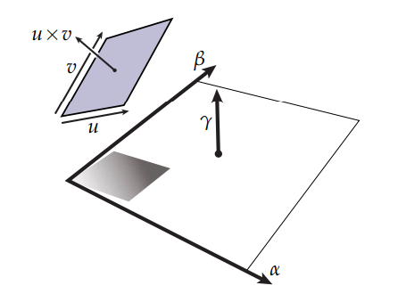

# k-Form
k形实际上是一种度量方式，比如说“2-Form”，也就意味着我们在寻找一种方式来度量一块2维平面，可以类比于“2-Form”度量了一小块钢板的质量，钢板是一个2向量，而质量只是一个标量。

既然是度量，那么就意味着它是一个标量。

## 对偶空间与余向量（Dual Space & Covectors）
首先，余向量是一种用来**度量**向量的手段，虽然说一个向量可以有一些基础的度量方式，比如说长度： $length=\sqrt{x^2+y^2+z^2}$ ，但这些度量都有一个前提，就是以 $xyz$ 作为基来进行度量的，但是有一些量，类比于密度，是一些空间本身的属性，它本身与 $xyz$ 坐标系无关，而是与所处的空间的相对位置有关，那么计算就会十分麻烦，比如说我在一个3维空间中平移或者旋转一根钢丝，钢丝上每一点的密度与其质量并不会随着它在 $xyz$ 空间的坐标改变而改变，因此就有了余向量与对偶空间的概念。

定义：

如果 $V$ 是一个实数向量空间，那么它的对偶空间 $V^*$ 就是所有能够使 $V\mapsto \mathbb{R}$ 的线性方程，且包含相加： $(\alpha+\beta)(u):=\alpha(u)+\beta(u)$ 与标量乘法： $(c\alpha)(u):=c(\alpha(u))$ 。

其中， $\alpha,\beta \in V^*,u\in V, c\in \mathbb{R}$

在对偶**向量**空间中的**元素**被称为对偶向量或余向量。

## k-Form
如前文所提到的，k向量是一种空间的属性，类似于一个物体的密度，我们也同样需要一种度量的方式，来知道空间某个属性的大小或者方向。

类比于向量场，k向量也同样可以被度量，而这种度量的方式就是**k-Form**。

> 行列式的作用：实际上行列式的值是有几何意义的，行列式值的大小代表了参与行列式运算的向量在空间中划分出的立体空间的大小（比如说 $3\times 3$ 行列式就是空间中一个以边为3个列向量的6面体体积大小），因此如果行列式中有两个线性相关的向量，行列式就无法在其所处的维度张成体积，会缩成一个“面”，也就会导致行列式值为0。此外，行列式的正负代表了是否对空间的方向进行了翻转。

假设以这么一个2Vector $\alpha \wedge \beta$ 作为参照，现在要度量另一个2Vector $u\wedge v$ ，那么首先，类似向量场，我们会将构成这个2向量的两个向量投影到 $\alpha \wedge \beta$ 上，即：

$$u\mapsto \alpha(u),\beta(u)$$

$$v\mapsto \alpha(v),\beta(v)$$

然后再进行外积运算，也就是行列式，就可以得到以得到以 $\alpha \wedge \beta$ 为参照的大小与方向。

$$(\alpha\wedge\beta)(u,v)=\alpha(u)\beta(v)-\beta(u)\alpha(v)$$

> 想简单一点理解就可以这么认为，现在有一个边长为1的正方形，他是**面积**的度量单位，就像1米是标准的长度度量单位，现在有另一个平行四边形于空间中，试问这个平行四边形相对于正方形的比例是多少，注意此时还存在**方向**问题，因此首先要干的事情就是把平行四边形投影到正方形上，原因还是**方向**，只有位于同一方向上，两个形状才能作比较，之后就是计算平行四边形的面积，就能知道平行四边形这么一个“2Vector”的面积属性的度量。

因此，类似于对偶向量空间，k-Form也可以大致定义成所有能使 $V\wedge\cdots\wedge V\mapsto\mathbb{R}$ 的线性方程，且k-Form同样是线性的，也就是说k-Form是可相加和标量乘的。

## 对偶
### 对偶基
对偶基与n维向量空间的基 $\{e_1,\cdots,e_n\}$ 有着特殊的关系：

$$e^i(e_j) = \left\{ \begin{array}{ll} 1 & if \quad i=j \\\\ 0 & otherwise \end{array}\right.$$

对偶基可以很好的帮助我们计算k形。

### 对偶性
此外，对偶性还有一些有意思的性质，如下图。

还是以2-Form为例子，在前文中有提到如何度量一个2Vector，并且给出了公式：

$$(\alpha\wedge\beta)(u,v)=\alpha(u)\beta(v)-\beta(u)\alpha(v)$$

但是除了直接计算他们的面积外，还可以计算他们的正交补，也就是说，因为本来就是计算一个平行四边形在标尺2-Form $\alpha \wedge \beta$ 上的度量值，那么计算他们的法向量也是一种**度量**方式，因此有：

$$\gamma(u\times v)=(\alpha\wedge\beta)(u,v)$$

