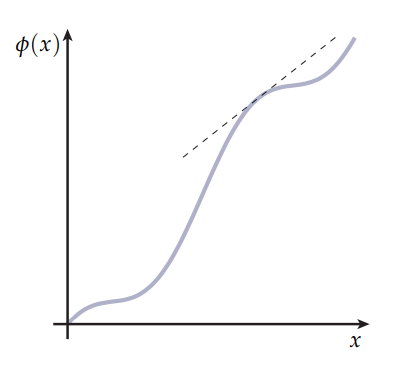
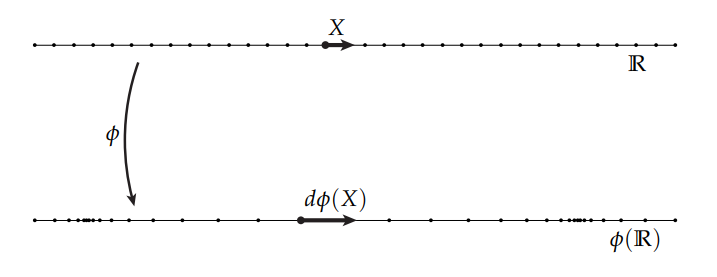
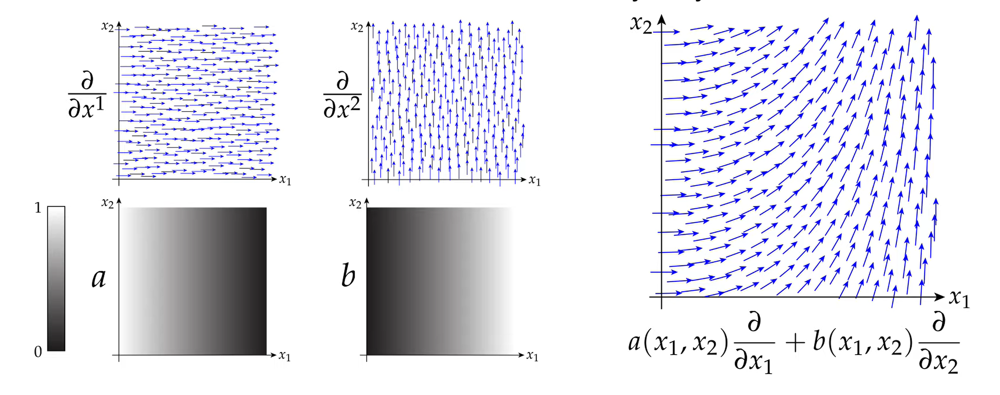
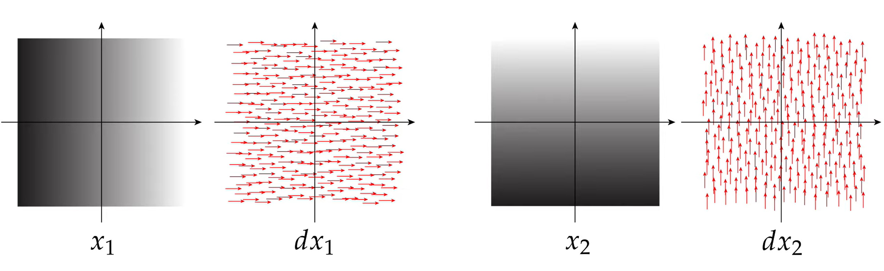
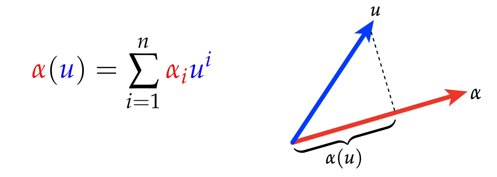
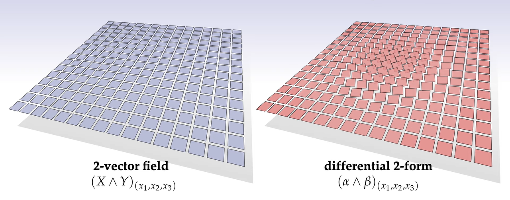

# Form微分
既然已经了解了如何对于一个k维的量进行度量（k-Form），那么接下来就是要拿着k-Form这把“尺子”去量我们需要测量的值了。

但需要意识到的是，空间是各个点上“尺子”的长度是不一定一样长的，就好比称重，称水果的时候我们用的是电子秤，称体重的时候我们用的是体重秤，或者说在谷仓里用的称又是另一种称，此外不仅用的称不一样，单位也可能不一样，像称量钢材的时候不可能使用的单位是 $g$ ，但是在称菜的时候肯定用的是 $g$ 作单位。

因而，**Form微分**就是用来解决这样在空间中分布着不同测量标准的问题的。但在理解Form微分之前，还需要再回顾一些导数，或者说微分的意义，这会对之后Form微分有一个更好的理解。

## 导数与切向量
一般来讲我们对于导数的理解就是一个函数图像的切线，如下图所示

但是这是因为我们将函数的值 $\phi(X)$ 与 $X$ 分开到两个坐标轴上导致的。形象的理解就是一根弹簧，我们把这个弹簧在某些地方拉长，在某些地方压缩，那么假设这个弹簧在不同位置的受力大小是 $\phi(X)$ ，那么站在物理空间的角度来看，弹簧并不会伸出去一个Y轴来表示拉伸或者压缩，因此我们对于导数还能有另一种理解方式： $d\phi(X)$ 实际上代表了一个在单位切向量 $\boldsymbol{X}$ 上的拉伸量，在弹簧的例子中，假设我们不弯折弹簧的话，那么切向量 $\boldsymbol{X}$ 就是沿着弹簧的方向：

这个看待导数的角度十分重要，也是接下来做外微分，或者说学习Form微分的基础。

我们看待Form微分不能真的将其想象为某个函数的切线，那是无法想象的，应该转而想象为其在空间中某一点朝某个方向的伸缩量，为什么除了空间坐标还需要方向？因为k-Form就是除了大小还有方向性的。所以在此处就能看到，对于k-Form求微分，实际上求的是一个方向导数。

## 外导数
在空间任意一点上，如果存在两个**微分形** $\alpha,\beta$ 属于 $\mathbb{R}^n$ ，则有：

$$(\star \alpha)_p=\star (\alpha_p)$$

$$(\alpha \wedge \beta)_p=(\alpha_p)\wedge(\beta_p)$$

实际上就是在说，是先对空间中的微分形进行外代数操作再考察空间每一个点的值，还是先考察空间中微分形的值，再进行外代数操作都是一样的。

### 向量场
对于任意向量场，都可以考虑其为一些基向量场的线性组合。也就是说，对于任意向量场，我们都可以线性的将其拆分为仅有1个基方向的向量场，比如一个二维向量场，可以将它拆为仅有 $x$ 方向和仅有 $y$ 方向的2个向量场：

> 如上图所示，右边的向量场被拆为了 $\frac{\partial}{\partial x^1}$ 和 $\frac{\partial}{\partial x^2}$ 两个方向，其各自在平面上每个点的数值如各自下方的灰度图所示。

### Form微分
对于Form微分，比如说1-Form，思路其实和向量场是一样的，我们也可以像向量场一样按照**基**对1-Form进行拆分：

有了这个拆分基础，先不急着去求Form微分，正如前文所言，Form微分实际上是一个方向导数，因此先看一下方向导数的意义。

#### 方向导数
方向导数的意义很简单，给定一个函数 $\phi:\mathbb{R}^n\mapsto \mathbb{R}$ ，一般来讲求导数，或者说多元函数，我们都是求偏导数的，但是方向导数的意思就是说我指定一个方向，你告诉我这个方向上，函数数值的变化率：

$$D_X\phi|_p:=\underset{\epsilon \rightarrow0}{lim}\frac{\phi (p+\epsilon X)-\phi (p)}{\epsilon}$$

> 式子的意义就是，从左往右看：D代表了方向导数，X表示了方向， $\phi$ 就是我们求方向导数的函数，p表示了我们在哪一点求方向导数。
> 此外 $\phi:\mathbb{R}^n\mapsto \mathbb{R}$ 的意思实际上就等价于 $\phi (x_1,x_2,\cdots,x_n)$ ，其中 $x_1,x_2,\cdots,x_n$ 的取值范围都是 $\mathbb{R}$ ，而函数的值域也是 $\mathbb{R}$ ，就是函数的另一种写法。

但是这样写方向导数还是太抽象了，我们刚刚提到了向量场可以按照正交基做线性的分解，那么方向导数可以做分解：

$$\begin{equation}\begin{aligned}D_X\phi|_p =& \frac{\partial \phi}{\partial x^1}X_1+\frac{\partial \phi}{\partial x^2}X_2 + \cdots +\frac{\partial \phi}{\partial x^n}X_n \\\\ =& \nabla\phi \cdot X  \end{aligned}\end{equation}$$

其中 $\nabla$ 是一个算子，读作“nabla”，并且 $\nabla=\begin{bmatrix}\frac{\partial}{\partial x^1} & \frac{\partial}{\partial x^2} & \cdots & \frac{\partial}{\partial x^n}\end{bmatrix}^T$ ，因此 $\nabla\phi = \begin{bmatrix}\frac{\partial \phi}{\partial x^1} & \frac{\partial \phi}{\partial x^2} & \cdots & \frac{\partial \phi}{\partial x^n}\end{bmatrix}^T$ ，然后按照两个向量点乘 $\nabla\phi$ 和 $X$ ，就能得到方向导数了。

#### Form微分
看完了方向导数，终于可以看Form微分了，刚才说了Form微分是一种方向导数，因此求导思路也是方向导数的求导思路。

首先先写出Form微分的数学表达： $d\phi$ ，这个符号就到表了我们要对 $\phi$ 这么一个k-Form进行微分，然后正如刚刚所提，Form微分实际上也算是一种方向导数，所以：

$$d\phi=\frac{\partial \phi}{\partial x^1}dx^1+\frac{\partial \phi}{\partial x^2}dx^2 + \cdots +\frac{\partial \phi}{\partial x^k}dx^k$$ 

这里之所以又出现了 $dx^k$ 这么个东西，实际上这个 $dx^k$ 也是代表了一种算符，回想一下在上一堂课k-Form中我们是怎样利用2-Form来度量一个平行四边形面的，我们先做了这样一个事情：

> 假设以这么一个2Vector $\alpha \wedge \beta$ 作为参照，现在要度量另一个2Vector $u\wedge v$ ，那么首先，类似向量场，我们会将构成这个2向量的两个向量投影到 $\alpha \wedge \beta$ 上，即：

$$u\mapsto \alpha(u),\beta(u)$$

$$v\mapsto \alpha(v),\beta(v)$$

我们像将两个向量 $u,v$ 投影到了2-Vector $\alpha\wedge\beta$ 上，那么这里就引出了一个概念，叫volumn Form，我们能发现k-Vector在k-Form中所干的事情，就是提取出每一个我们要去度量的向量，在这个例子中就是 $u,v$ 在各自分量上的值，比如说 $\alpha$ 提取出了 $\alpha(u),\alpha(v)$ 这么两个值。

> 这张图就展示了1-Form的度量方式，图中红色的线就是一个1维的尺子，被称之为1-Vector，而蓝色的线 $u$ 就是我们要度量的对象，1-Form就是 $\alpha(u)$ ，也就是我们提取出了 $\alpha$ 方向上 $u$ 的分量。

此外， $\alpha\wedge\beta$ 按照之前的定义，是空间中一块有朝向的平面的度量“尺度”，可是我们想的想法是这样的：我们想要度量空间中每一个点，在这个点上，空间中的平面碎片在我这个尺子的度量下值是多（比如说这个小碎片和我的尺子的**方向**到底有多对齐）

> 左图就是我们说的空间中每个点上的二维平面小碎片，而右边就是分布在空间中每个点上度量相应平面碎片的尺子，有很多个这样无限小的尺子，因此右边被称为**Form微分**，这张图上的就是**微分2-Form**。

按照微分的想法，如果能缩小尺子，缩小到无限小，那么我们就会写成 $dx^1\wedge dx^2$ ，这样的形式就被称作volume form，非常形象，就是翻译过来就是“一种度量形状的形式”（顺带一提k-Form可以理解为“度量k维的形式”）

回到 $d\phi=\frac{\partial \phi}{\partial x^1}dx^1+ \cdots +\frac{\partial \phi}{\partial x^k}dx^k$ 上来。也就是说我们对k-Form $\phi$ 进行一次微分，就是对于空间上某一点p，p点的k-Vector不是会有一个朝向嘛，我们问p点上k-Vector向着它的朝向膨胀或者压缩的大小是多少，**就像方向导数一模一样**，因此会写成这样：

$$d\phi=\frac{\partial \phi}{\partial x^1}+ \cdots +\frac{\partial \phi}{\partial x^k}$$ 

但是这样对于k-Form是不够的，我们在度量空间中的值的时候，必须投影到k-Vector上去才能进行度量，反过来看就是我们需要k-Vector提取出我们需要度量的形状再k-Vector上各个方向上的值，然后再进行测量，因此有了:

$$d\phi=\frac{\partial \phi}{\partial x^1}dx^1+ \cdots +\frac{\partial \phi}{\partial x^k}dx^k$$ 

至此搞定了 $d\phi$ 的形式，但是现在的问题是，我们把k-Form分解了，分解成了各个由正交基构成的volume-Form了（ $de_1\wedge\cdots\wedge de_k$ ）：

$$\omega=\sum_If_Idx_I \quad I=\{i_1,\cdots,i_m\}$$

那么现在要求 $d\omega$ ，也就是对于构成 $\omega$ 的每一个分量 $fdx_I$ 求微分(所在空间维度为 $n$ )：

$$d(f \, dx_I)=\frac{\partial f}{\partial x^1}dx^1\wedge dx_I+\cdots+\frac{\partial f}{\partial x^n}dx^n\wedge dx_I$$

举一个具体的例子：

如果 $\alpha=A(x,y,z)dx+B(x,y,z)dy+C(x,y,z)dz$ ，其中 $A,B,C$ 都是在3维空间中的0-Form，那么:

$$\begin{equation}\begin{aligned}d\alpha =\frac{\partial A}{\partial x}dx\wedge dx + \frac{\partial A}{\partial y}dy\wedge dx + \frac{\partial A}{\partial z}dz\wedge dx + \\\\ \frac{\partial B}{\partial x}dx\wedge dy + \frac{\partial B}{\partial y}dy\wedge dy + \frac{\partial B}{\partial z}dz\wedge dy + \\\\ \frac{\partial C}{\partial x}dx \wedge dz+ \frac{\partial C}{\partial y}dy\wedge dz + \frac{\partial C}{\partial z}dz\wedge dz\quad \end{aligned}\end{equation}$$

$$ d\alpha = (\frac{\partial B}{\partial x}-\frac{\partial A}{\partial y})dx\wedge dy+(\frac{\partial C}{\partial y}-\frac{\partial B}{\partial z})dy\wedge dz+(\frac{\partial C}{\partial x}-\frac{\partial A}{\partial z})dx\wedge dz$$

## 梯度、散度与旋度
我们老是在说Form是一种度量方式，但是既然是度量方式，那么就有一个问题，我们要度量什么？这里就引出了这个标题上的三个东西。

梯度的几何意义是空间中一个点变化最快的方向，它可以变为一个1-Form；旋度是求空间中一个点的发散的**强度**，它可以变为一个0-Form；旋度是测定空间中一个点旋转的**强度**与方向（由右手定则决定），它可以变为一个1-Form，为什么说可以变为，因为向量场与Form实际上是一个**度量视角**的转变。

但是一般来讲这些东西都是由向量表示的，那怎么才能把他们变成Form的形式呢？这个就要用到之前提到的 $\sharp$ 和 $\flat$ 了。

假设有一个三维的向量场:

$$X=u\frac{\partial}{\partial x}+v\frac{\partial}{\partial y}+w\frac{\partial}{\partial z}$$

以及一个标量场：

$$\phi(x,y,z)$$

### 梯度
梯度的公式是：

$$\nabla \phi=\begin{bmatrix} \frac{\partial \phi}{\partial x} & \frac{\partial \phi}{\partial y} &\frac{\partial \phi}{\partial z} \end{bmatrix}^T=a\frac{\partial}{\partial x}+b\frac{\partial }{\partial y}+c\frac{\partial}{\partial z}$$

这里的 $\frac{\partial}{\partial x},\frac{\partial}{\partial y},\frac{\partial}{\partial z}$ 代表了方向。

而又因为 $\phi$ 是一个标量场，或者说可以看作是一个0-Form，因此想要将梯度变为1-Form，就只需要求Form微分就行了：

$$d\phi=a\,dx+b\,dy+c\,dz$$

此时就出现了我们熟悉的向量与1-Form的形式转换，也就是**降号与升号**（ $\sharp$ 和 $\flat$ ），因此：

$$\nabla \phi=(d\phi)^{\sharp}$$

### 散度
散度的公式是：

$$\nabla\cdot X=\frac{\partial u}{\partial x} + \frac{\partial v}{\partial y} + \frac{\partial w}{\partial z}$$

如果想要转换散度为度量标准，那么散度将会是一个0-Form，但是X这个向量场降号之后也只是一个1-Form，而每一次做Form微分都会导致维度加1，但是Form有一个隐藏的特性，在之前Form的最后提到过，就是用Form的正交补Hodge Star（ $\star$ ）进行度量与用Form本身进行度量是一样的，因此：

$$X^{\flat}=udx+vdy+wdz$$

$$\star X^{\flat}=udy\wedge dz+vdz\wedge dx+wdx\wedge dy$$

这是一个2-Form，我们注意到， $\nabla$ 算子是对每一个 $X$ 的每一个项分别做偏导数，在Form中就是要求Form微分，因此：

$$d\star X=(\frac{\partial u}{\partial x}+\frac{\partial v}{\partial y}+\frac{\partial w}{\partial z})dx\wedge dy\wedge dz$$

这已经离散度这个0-Form很接近了，还是利用Form正交补的特性，就可以得到散度了：

$$\nabla \cdot X=\star d\star X^{\flat}$$

### 旋度
旋度也是同理，旋度的公式是：

$$\nabla \times X$$

过程就省略了，最后可以推到出：

$$\nabla \times X=(\star(dX^{\flat}))^{\sharp}$$

简单理解就是叉乘本身就是求X的正交方向，而旋度又是对X每个方向进行微分后再求正交，因此要先微分 $dX^{\flat}$ ，再求正交补 $\star(dX^{\flat})$ ，最后再用 $\sharp$ 转化回向量，才是散度。

## 后记
如果实在不理解Form微分在说什么，可以详细看一下[这个视频](https://www.youtube.com/watch?v=4--S4N8YDmE&list=PL22w63XsKjqzQZtDZO_9s2HEMRJnaOTX7&index=14)，详细推导了Form微分。

最后，为什么要求Form微分，为什么梯度、散度、旋度要去转化为Form微分的形式，或者说为什么能转化？试想一下现在有一个湍急的溪流，溪流里面有漩涡，有泉眼，溪流流经的地方有高低起伏的落差，现在你要撒一把沙子到这个溪流里面，试问这个沙子的运动怎么模拟？这里就要运用到上面提的微分Form，溪流本身是一种向量场，但现在我们在计算的是沙子，那么这个沙子就是**被度量**的对象，而溪流本身就是**度量标准**。