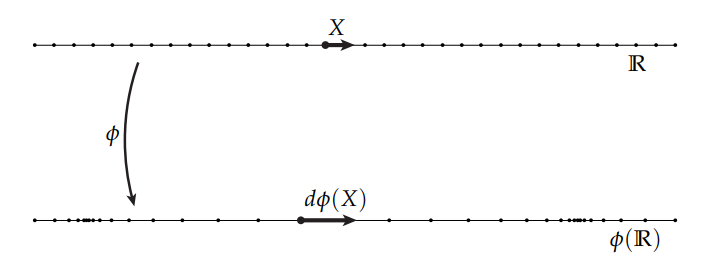

# 微分形
k形的微分形式实际上**度量**对于分布在空间中，某个量的的变化。

类似于向量场，在空间中的每个点上，都分布着一个k形，因此也可以类比于向量场，离散的计算出空间上每一个点的k形微分。

## 导数与切向量
一般来讲我们对于导数的理解就是一个函数图像的切线，如下图所示

但是这是因为我们将函数的值 $\phi(X)$ 与 $X$ 分开到两个坐标轴上导致的。形象的理解就是一根弹簧，我们把这个弹簧在某些地方拉长，在某些地方压缩，那么假设这个弹簧在不同位置的受力大小是 $\phi(X)$ ，那么站在物理空间的角度来看，弹簧并不会伸出去一个Y轴来表示拉伸或者压缩，因此我们对于导数还能有另一种理解方式： $d\phi(X)$ 实际上代表了一个在单位切向量 $\boldsymbol{X}$ 上的拉伸量，在弹簧的例子中，假设我们不弯折弹簧的话，那么切向量 $\boldsymbol{X}$ 就是沿着弹簧的方向：

这个看待导数的角度十分重要，也是接下来外微分的基础。

## 外导数

### $\nabla$ 算子
$\nabla$ 算子表示了对空间所有坐标轴的偏导：

$$\nabla :=(\frac{\partial}{\partial x^1}, \cdots, \frac{\partial}{\partial x^n})^T$$

### 梯度
梯度可以被写成：

$$\nabla f=(\frac{\partial f}{\partial x^1}, \cdots, \frac{\partial f}{\partial x^n})^T$$

但是这样写很明显要依赖坐标来完成，毕竟梯度的各个分量就是对某个坐标的偏导数，但是在微分几何中，我们研究的是几何体的局部性质，不能依赖于坐标系本身，因此会将梯度写成：

$$<\nabla\phi,X>=D_X\phi$$

