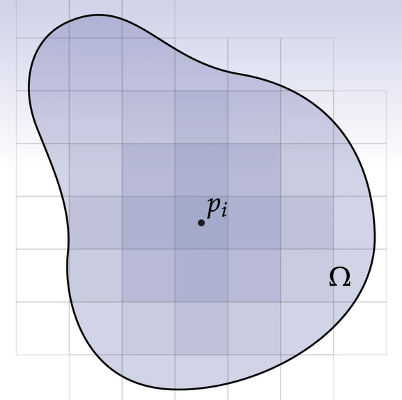
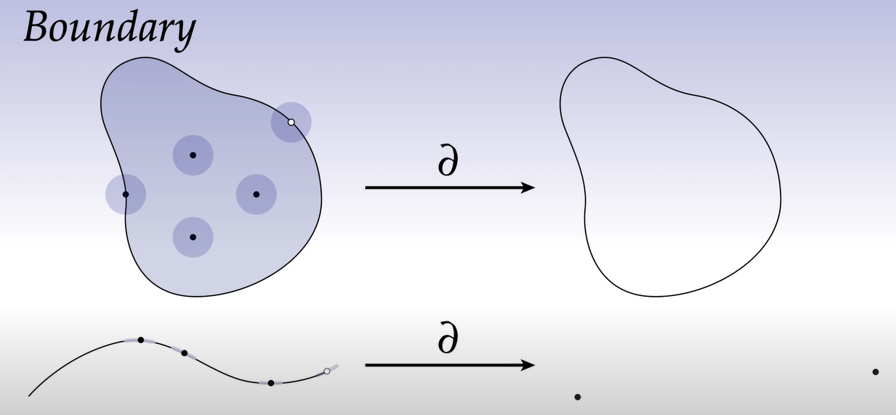
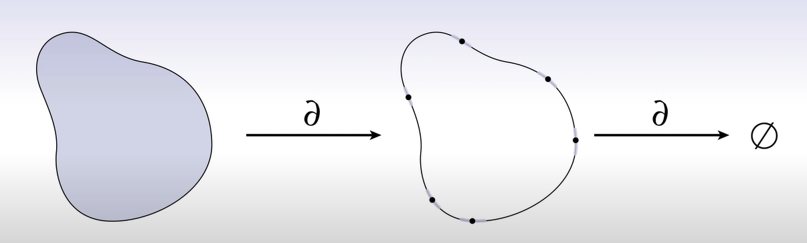

# Form积分
看完了Form微分，接下自然就是Form积分，实际上Form积分的基本思想是和普通的积分的思想一模一样的，都是细分求和。

## 标量积分
现在有这么一个二元函数 $\phi(x,y)$ ，然后有这么一片区域 $\Omega$ ，试问在 $\Omega$ 上的积分是多少，这个很简单就是一个二重积分能搞定的：

$$\int\int\phi(x,y)dxdy=\int_{\Omega}\phi dA$$

当然，重要的是这个积分背后的思想：

我们取一篇极小的正方形面积 $dA=dxdy$ ，并假设在这一个极小的正方形上，它的面密度（假设这个 $\Omega$ 是一块钢板）就是 $\phi(x,y)$ ，其中 $x,y$ 的取值就是这一个极小的正方形所在的坐标 $p_i$ 。

在离散的情况下就会变成：

$$\sum_i A_i\phi(p_i)$$

也就是离散的计算一小块正方形的面积 $A_i$ ，比如说让 $A_i=0.0001$ ，并乘以其所对应的 $\phi(p_i)$ 或者说是 $\phi(x_i,y_i)$ 。

## Form积分
### 2-Form积分
2-Form积分可以类比与上面的这个面积分，同样是取极小的一块“面积”，只不过这次的面积是volume Form，也就是 $dx^1\wedge x^2$ ，然后再取这块面积上的对应需要测量的值 $\phi(x,y)$ ，基本上一致：

$$\int_{\Omega}\phi(x_1,x_2)dx^1\wedge dx^2=\int_{\Omega}\omega$$ 

但实际上在计算的时候我们 $\wedge$ 这个符号并不起什么特殊作用，还是按照二重积分的方式计算。所以之前兜了那么大的圈子，还是只是算一个二重积分……吗？

一般来讲对于三角形网格面，如之前提到过的，可以看作一个简单2复形，也就是都是由简单2形（三角形）组成的**面**，那么对其简单应用二重积分即可。

但是，有一个问题就是，理论上行得通并不代表实际上行得通，如之前看到的，离散的计算二重积分需要取一个极小量，并在**面**上做积分，那这样带来的计算量是十分巨大的，计算机有些时候可能耗不起这么大的计算量，那这个时候就需要一些别的方式来规避这么庞大的计算。

### 边界
虽然边界有着严格的数学定义，不过你可以认为就是一堆点集，在这个点集周围无论取多小半径的一个小圆作为它的邻域，圆都会有一部分不在图形内部，这大概就是边界的定义，换到实际的计算机图形中就会变得更简单，**边界**就是三角形网格的面或者边。

> $\partial$ 这个符号代表了对图形进行取**边界**的操作，上图是一个封闭面的边界，是一个封闭圈；下图是一段线的边界，就是两个点。

但现在有一个问题，**边界**的**边界**是什么？按照之前的定义，你需要找到一个点集，在这个点集里，所有点的邻域都有落在图形外面的部分，还是继续那个图形：

面的边界是一个封闭的圈，圈是一个一维的形状，那么在圈上的邻域，或者说小的圆，就是点前后一小段距离，那么能找到符合边界标准的点吗？并不能。实际上对于任意维度的**流形**，边界的边界都是空集 $\emptyset$ 。

这个性质也侧面反映出了Form微分中的一个特性，即：

$$d\circ d=0$$

### Stoke定理
为什么要说边界的事情？很简单，为了简化计算。怎么简化积分计算？回想一下积分是如何计算的，例如一个普通的积分方程：

$$\int_a^b f(x)dx=F(b)-F(a)$$

也就是说即便函数内部无比复杂（前提是连续），最后的积分结果都仅仅是原函数两端的值做了一个减法，那放到计算机的世界里就很离谱了，等式的**左边**是一个积分，我们要做的运算次数可能是1000或者10000次，取决于离散的程度，但是等式的**右边**，却只进行了1次运算，因此就会想，有没有一种方法，能够让我们在积分的时候都能这样减少计算呢？

有，这就是Stoke定理：

$$\int_{\Omega}d\alpha=\int_{\partial\Omega}\alpha$$

上面的公式翻译一下就是在说，如果我有一个 $n$ 维的空间 $\Omega$ ,我想在这个空间上对 $d\alpha$ 这个volume Form积分，那么其实可以变成在 $\Omega$ 的边界上直接对 $\alpha$ 这个 $(n-1)$ 维的Form进行积分。

 > $\partial$ 这个符号代表了取边界

 
